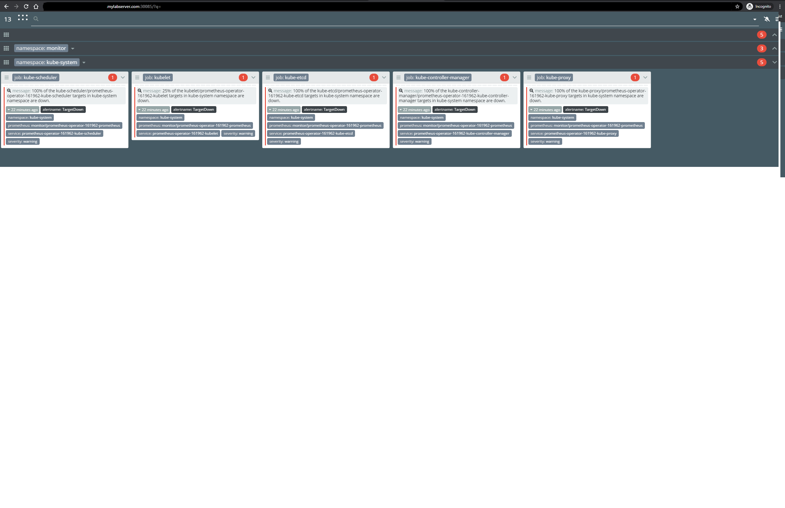

# Karma-UI
# Alert dashboard for Prometheus Alertmanager.

The example deployment project karma UI Alertmanager to k8s

## Installation

Clone with HTTPS or SSH. 


```bash
https://github.com/Amikh/Karma-UI.git
```

## Usage

```bash
1. In configmap change URI PROMETHEUS
2. kubectl apply -f project.yml
3 .kubectl apply -f deployment.yml
4. kubectl apply -f svc-karma.yml
5. kubectl apply -f config-map-karma.yml

Then can to open application <ip-master-node:30085>
```
<p align="center">
 </img> 
</p>

## Contributing
Pull requests are welcome. For major changes, please open an issue first to discuss what you would like to change.

Please make sure to update tests as appropriate.

## License
[MIT](https://choosealicense.com/licenses/mit/)